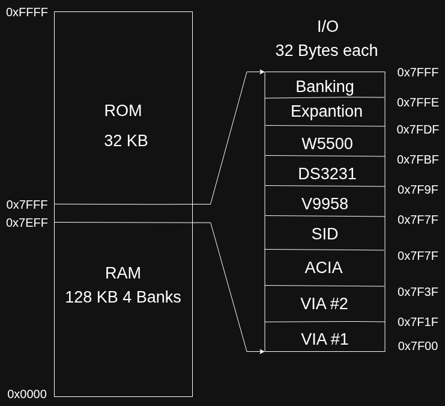

# Lambda One

> A modern educational computer built around the **Western Design Center W65C816S**, combining classic computer architecture with modern design practices, clean documentation, and an expandable hardware platform.


---

## Overview

Lambda One is a personal hobby computer designed as a platform for learning and experimenting with classic computer architecture. Rather than emulating vintage hardware, the project aims to build a complete computer from individual integrated circuits using modern PCB design and documentation standards.

The computer is based on the **W65C816S**, the 16-bit successor to the famous 6502 processor, and combines it with well-known peripherals such as the Yamaha V9958 video processor, MOS 8580 SID sound chip, W65C22 VIA interface adapters, and Ethernet connectivity through the W5500.

The project emphasizes simplicity, readability, and expandability over raw performance. Every hardware decision is made with education and understanding in mind, making the computer approachable both for beginners and experienced enthusiasts interested in retro computing.

Although inspired by classic home computers from the 1980s, Lambda One is not intended to recreate any existing machine. Instead, it is designed as its own computer with a modern workflow, open documentation, and room for future expansion.

---

## Goals

The primary goals of the project are:

- Learn the W65C816 architecture in depth.
- Build a complete computer using individual ICs.
- Create clean and understandable schematics.
- Keep the hardware relatively simple without sacrificing functionality.
- Use modern PCB design practices.
- Produce thorough documentation for every subsystem.
- Design a platform that can easily be expanded in future revisions.
- Develop a custom ROM operating system tailored specifically for the hardware.
- Make the entire project open source.

---

## Current Status

The project is currently in the **Early Hardware Design** phase.

Current work includes:

- Hardware architecture
- Memory map
- Component selection
- KiCad schematic development

The PCB has not yet been manufactured, and no firmware or operating system has been written at this stage.

---

## Hardware Specifications

| Component | Part |
|------------|------|
| **CPU** | W65C816SxP (40-pin DIP) |
| **RAM** | Alliance Memory AS6C1008-55PCN (128 KB SRAM) |
| **ROM** | AT28C256 EEPROM (32 KB) |
| **GPIO** | 2 × W65C22 VIA |
| **Serial** | W65C51 ACIA |
| **Sound** | MOS 8580 SID |
| **Video** | Yamaha V9958 |
| **Storage** | SD Card (SPI via VIA) |
| **Real-Time Clock** | DS3231 |
| **Networking** | W5500 Ethernet Controller |
| **Address Decoder** | ATF22V10 |
| **Reset Supervisor** | DS1813 |
| **Clock** | 14.7456 MHz |

---

## Memory Map



The current memory layout reserves the lower portion of the address space for RAM while placing the system ROM in the upper half of memory. Memory-mapped peripherals occupy a dedicated region near the boundary between RAM and ROM.

### RAM

The computer contains **128 KB of SRAM** provided by an **Alliance Memory AS6C1008-55PCN**.

Since the W65C816 exposes a 16-bit address bus externally, additional RAM is accessed through bank switching. A bank register selects which 32 KB section of physical SRAM is visible within the processor's address space.

This provides significantly more memory while maintaining compatibility with the processor's external interface.

### ROM

The upper 32 KB of the address space contains an **AT28C256 EEPROM**.

The ROM is intended to contain:

- System kernel
- Device drivers
- Boot routines
- Command shell
- File system support
- Development tools
- Built-in programming language

Eventually this ROM will function as both the firmware and operating system of Lambda One.

### I/O Space

Memory-mapped I/O occupies a dedicated region beginning at **0x7F00**.

Each peripheral receives a 32-byte address window, greatly simplifying address decoding while leaving room for future expansion.

Current peripherals include:

| Address | Device |
|---------|--------|
| 0x7F00 | VIA #1 |
| 0x7F20 | VIA #2 |
| 0x7F40 | W65C51 ACIA |
| 0x7F60 | MOS 8580 SID |
| 0x7F80 | Yamaha V9958 |
| 0x7FA0 | DS3231 RTC |
| 0x7FC0 | W5500 Ethernet |
| 0x7FE0 | Reserved Expansion |

The exact memory map may evolve throughout development.

---

## Major Components

### W65C816S

The W65C816S is a modern CMOS implementation of the classic 6502 architecture with native 16-bit capabilities.

It maintains compatibility with existing 6502 software while introducing:

- 24-bit addressing
- Larger register sizes
- Higher performance
- Banked memory
- Additional instructions

It serves as the heart of Lambda One.

---

### AS6C1008 SRAM

The Alliance Memory AS6C1008 provides 128 KB of fast static RAM.

Unlike DRAM, SRAM requires no refresh circuitry, simplifying the hardware considerably while providing excellent access times suitable for the W65C816.

---

### AT28C256 EEPROM

The system firmware is stored in an electrically erasable EEPROM.

Unlike UV EPROMs, it can be reprogrammed directly using a programmer without ultraviolet light, making development significantly easier.

---

### W65C22 VIA

Two W65C22 Versatile Interface Adapters provide general-purpose I/O.

Together they offer:

- Parallel I/O
- Timers
- Interrupt generation
- Handshaking
- SPI bit-banging for SD card support

They form the primary interface between the CPU and external peripherals.

---

### W65C51 ACIA

The Asynchronous Communications Interface Adapter provides serial communication.

This enables:

- Terminal access
- Debugging
- Firmware upload
- Communication with modern computers

---

### MOS 8580 SID

The SID is the iconic sound chip originally developed for the Commodore 64.

It provides three programmable voices, waveform generation, filtering, and envelope control, allowing Lambda One to produce authentic synthesizer-style audio.

---

### Yamaha V9958

The V9958 is a dedicated video display processor originally used in MSX2+ computers.

It features:

- Hardware sprites
- Tile-based graphics
- Bitmap modes
- Independent video RAM
- Hardware scrolling

Using a dedicated graphics processor significantly reduces CPU overhead for video output.

---

### DS3231

The DS3231 is a high-precision real-time clock with an integrated temperature-compensated crystal oscillator.

It maintains accurate date and time even when the main system is powered off.

---

### W5500 Ethernet Controller

Networking is provided by the W5500.

This hardware TCP/IP controller implements the networking stack internally, allowing the W65C816 to communicate over Ethernet without the burden of implementing TCP/IP entirely in software.

---

### ATF22V10

Address decoding is implemented using an ATF22V10 programmable logic device.

Using programmable logic instead of multiple discrete logic chips:

- reduces chip count,
- simplifies PCB routing,
- allows future address map modifications,
- improves maintainability.

---

### DS1813

The DS1813 reset supervisor guarantees reliable startup by holding the processor in reset until the power supply is stable.

---

## Planned Software

The ROM will eventually contain a custom operating environment designed specifically for Lambda One.

Planned features include:

- ROM-based kernel
- Interactive command shell
- Built-in monitor/debugger
- Device drivers
- FAT-compatible SD card support
- Simple multitasking (experimental)
- Ethernet support
- Custom programming language (not BASIC)
- Assembler
- Utilities
- Development tools

The programming language is planned to be designed specifically for Lambda One rather than adopting an existing language like Microsoft BASIC.

---

## Repository Structure

```
Lambda-One/
├── img/            # Images and diagrams
├── kicad/          # KiCad schematics and PCB files
├── LICENSE
└── README.md
```

Additional directories will be added as the project progresses.

---

## Roadmap

### Hardware

- [x] Select CPU
- [x] Select peripherals
- [x] Design memory map
- [ ] Complete schematic
- [ ] PCB Revision A
- [ ] PCB assembly
- [ ] Initial power-on
- [ ] Hardware validation

### Firmware

- [ ] Boot ROM
- [ ] Memory tests
- [ ] Serial monitor
- [ ] SD card support
- [ ] Video driver
- [ ] Sound driver
- [ ] Ethernet driver

### Operating System

- [ ] Kernel
- [ ] File system
- [ ] Shell
- [ ] Custom programming language
- [ ] Documentation

---

## Why "Lambda One"?

The name **Lambda One** reflects the project's identity as a modern, cleanly designed computer inspired by classic systems while remaining its own platform.

Rather than recreating an existing machine, Lambda One aims to become a unique educational computer focused on learning, experimentation, and open hardware development.

---

## Contributing

Although the project is currently in its early hardware design phase, suggestions, discussions, bug reports, and design feedback are always welcome.

If you'd like to contribute, feel free to open an Issue or submit a Pull Request.

---

## License

This project is licensed under the **MIT License**.

See the [LICENSE](LICENSE) file for details.
