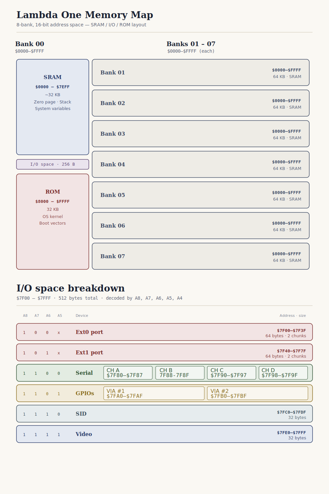

# Lambda One

> A modern educational computer built around the **Western Design Center W65C816S**, combining classic 16-bit computer architecture with robust hardware design, high-resolution video, modern USB connectivity, and rich expandability.

---

## Overview

Lambda One is a personal hobby computer designed as a hardware platform for exploring and experimenting with retrocomputer design. The project focuses on building a complete 16-bit computer from discrete integrated circuits using modern PCB layout standards, structured system design, and open documentation.

At its core is the **W65C816S**, the native 16-bit successor to the legendary 6502 microprocessor. Rather than limiting the architecture to vintage constraints, the platform integrates modern conveniences and robust features: 512 KB of banked SRAM, a high-performance Yamaha V9958 video display processor with 128 KB of dedicated VRAM, a flexible SC16C654 Quad UART yielding onboard USB-serial interfaces, hardware TCP/IP Ethernet networking, and real-time clock tracking.

The design prioritizes structural clarity, clean logic decoding, and modular hardware expansion over raw clock-speed optimization. This makes the computer approachable for developers interested in low-level operating system assembly, hardware interface programming, and classic computer systems design.

---

## Goals

- Learn and master the W65C816S 16-bit architecture in a bare-metal environment.
- Construct a complete single-board computer using physical, easily understood ICs.
- Create highly detailed, readable, and reproducible schematics.
- Implement highly efficient address decoding using programmable logic.
- Integrate modern connectivity, such as direct USB debugging and Ethernet, directly onto the motherboard.
- Keep the hardware approachable and friendly to hand-assembly.
- Write a clean, modular custom ROM operating system from scratch.

---

## Current Status

The project is currently in the **Schematics Complete / Moving to PCB Layout** phase.

- **Schematics**: Completed (v1) and thoroughly verified across all subsystems.
- **Logic Design**: Address decoding written, compiled, and validated using CUPL logic equations.
- **Hardware Integration**: High-density footprints (like the Quad UART, video RAM matrix, and PLD) are fully integrated.
- **Next steps**: PCB component placement, power delivery routing, and track routing in KiCad.

---

## Hardware Specifications

| Component | Description | Part |
|------------|-------------|------|
| **CPU** | 16-Bit Microprocessor (40-pin DIP) | W65C816SxP |
| **System Clock** | 8 MHz Crystal Oscillator | TFT680 |
| **RAM** | 512 KB Static RAM (Bank Switched) | Alliance Memory AS6C4008-55PCN |
| **ROM** | 32 KB Low-Voltage EEPROM | AT28LV256 |
| **Video Display** | MSX2+-class Video Display Processor | Yamaha V9958 |
| **Video RAM** | 128 KB VRAM (4 × 64K×4 DRAM matrix) | 4 × 41464 |
| **Serial / UART** | Quad Channel UART with 64-byte FIFO | NXP SC16C654DBIB64 |
| **USB Connectivity** | Dual Onboard USB-to-Serial Bridges | 2 × CH340C (USB-C & USB-A) |
| **GPIO** | Dual Versatile Interface Adapters | 2 × W65C22S VIA |
| **Sound** | 3-Voice Synthesizer Chip | MOS 8580 SID (Logic Mapped) |
| **Networking** | Hardware TCP/IP Ethernet Module | W5500 (via WIZ850io Breakout) |
| **Real-Time Clock** | High-Precision I2C RTC | DS3231 (via DeadOn RTC Breakout) |
| **Storage** | Secure Digital Storage Slot | Micro SD Card Breakout (SPI) |
| **Address Decoder** | 24-pin Erasable Programmable Logic Device | ATF22V10C |
| **Reset Supervisor** | Active-Low Reset Controller with Debounce | DS1813 |

---

## Address Decoding & Memory Map

The Lambda One uses an ATF22V10C PLD to decode the address space of Bank 0. High-level memory is divided into three primary segments: System RAM, an I/O peripheral page, and System ROM. 

### High-Level Memory Map

| Address Range | Size | Logical Space | Chip Select Signal | Description |
|---|---|---|---|---|
| **`$0000 - $7EFF`** | ~32 KB | Bank 0 RAM | `n_RAM_CS` | Lower half of Bank 0 System RAM |
| **`$7F00 - $7FFF`** | 256 B | Bank 0 I/O Page | (Varies) | Dedicated memory-mapped peripheral block |
| **`$8000 - $FFFF`** | 32 KB | Bank 0 ROM | `n_ROM_CS` | Read-only memory for boot firmware / OS kernel |
| **`Banks $01 - $07`** | 448 KB | Extended RAM | `n_RAM_CS` | 7 physical pages of banked RAM (64 KB each) |

*Note: The physical 512 KB of SRAM is addressed using a 74HC373 latch (`BankRegister1`). This register captures the bank address from the CPU's multiplexed data bus during the Phase 1 ($\phi_1$) clock cycle, driving physical address lines `A16`, `A17`, and `A18` to enable seamless banking across the 8 logical windows.*

### I/O Page Map (`$7F00 - $7FFF`)

The 256-byte peripheral block at `$7F00 - $7FFF` is subdivided into dedicated chip select zones by the ATF22V10C PLD and supplementary logic gates:

| Address Range | Size | CS Signal | Subsystem / Device | Description |
|---|---|---|---|---|
| **`$7F00 - $7F3F`** | 64 B | `n_E0_CS` | **Expansion Header Ext0** | General system expansions and prototyping |
| **`$7F40 - $7F7F`** | 64 B | `n_E1_CS` | **Expansion Header Ext1** | General system expansions and prototyping |
| **`$7F80 - $7F9F`** | 32 B | `SERIALCs` | **SC16C654 Quad UART** | See the Quad UART breakdown below |
| **`$7FA0 - $7FAF`** | 16 B | `GPIOCs` (A4=0) | **W65C22S VIA #1 (U4)** | Dedicated general-purpose User Port (GPIO C & D) |
| **`$7FB0 - $7FBF`** | 16 B | `GPIOCs` (A4=1) | **W65C22S VIA #2 (U2)** | System controller managing the master SPI bus |
| **`$7FC0 - $7FDF`** | 32 B | `n_SCS` | **MOS 8580 SID** | Classic synthesizer audio |
| **`$7FE0 - $7FFF`** | 32 B | `n_VCS` | **Yamaha V9958 VDP** | Dedicated video display processor registers |

#### SC16C654 Quad UART Subspace Breakdown (`$7F80 - $7F9F`)

The Quad UART occupies 32 bytes of address space, providing 8 registers per channel:

*   **Channel A** (`$7F80 - $7F87`): Connected to onboard **USB-C Port (J5)** via a CH340C bridge. Serves as the primary system debug and boot terminal.
*   **Channel B** (`$7F88 - $7F8F`): Connected to onboard **USB-A Port (J7)** via a CH340C bridge. Ideal for auxiliary communications.
*   **Channel C** (`$7F90 - $7F97`): Routed to a dedicated **5V TTL logic-level header (J8)**.
*   **Channel D** (`$7F98 - $7F9F`): Routed to a dedicated **5V TTL logic-level header (J9)**.

---

## Architecture Design Detail

### Modular Breakout Integration

To maintain excellent signal integrity and keep the mainboard highly accessible for hand-assembly, Lambda One implements complex high-frequency and sensitive peripheral systems using standardized modular breakout boards:

*   **Ethernet (WIZ850io Breakout)**: Houses the W5500 chip, onboard magnetics, and an RJ-45 port. By offloading the TCP/IP stack to dedicated hardware and utilizing pre-isolated layout modules, high-frequency network noises are kept away from the sensitive system bus.
*   **Real-Time Clock (DeadOn RTC Breakout)**: Integrates the high-precision, temperature-compensated DS3231 RTC oscillator and a CR1220 backup battery holder in a compact, noise-shielded module.
*   **Micro SD Card Breakout**: Houses a reliable card socket with standard level-shifting to simplify safe interactions with high-capacity flash storage.

### Master SPI Bus Routing

The system's master SPI bus is implemented via software bit-banging on **VIA #2 (U2)**. Using Port B of the interface adapter, the system controls clocking and registers while orchestrating communication with multiple SPI devices using dedicated active-low select signals:

*   `PB0` $\rightarrow$ **MOSI** (Master Out Slave In)
*   `PB1` $\rightarrow$ **MISO** (Master In Slave Out)
*   `PB2` $\rightarrow$ **SCK** (Serial Clock)
*   `PB3` $\rightarrow$ `SPL_CS0` $\rightarrow$ **DS3231 Real-Time Clock**
*   `PB4` $\rightarrow$ `SPL_CS1` $\rightarrow$ **W5500 Ethernet Adapter**
*   `PB5` $\rightarrow$ `SPL_CS2` $\rightarrow$ **Micro SD Storage Card**
*   `PB6` $\rightarrow$ `SPL_CS3` $\rightarrow$ **External SPI Header 1** (For user expansion)
*   `PB7` $\rightarrow$ `SPL_CS4` $\rightarrow$ **External SPI Header 2** (For user expansion)

---

## Planned Software

The ROM is designed to boot directly into a custom ROM-based operating system structured for system configuration and user software execution. 

Key planned layers include:
- **System Kernel**: Handles base interrupts, memory bank allocation, and system execution states.
- **Hardware Abstraction Layer (HAL)**: Hardware-specific drivers for SPI-based storage, the W5500 Ethernet stack, and RTC clock management.
- **Integrated Video/Audio Engines**: Low-overhead sprite, tile, and geometric graphic drawing functions for the Yamaha V9958 alongside sound synthesizers.
- **Interactive Command Shell**: Accessible over USB Serial Channel A, providing memory editors, machine code monitors, file systems management, and system debugging tools.

---

## Roadmap

### Hardware
- [x] Select CPU & Peripherals
- [x] Design Memory Mapping logic
- [x] Complete KiCad schematic layout
- [ ] Complete PCB routing & physical layout
- [ ] Manufacture PCB Revision A
- [ ] Assembly & power-on testing
- [ ] Hardware verification of clocks, rails, and buses

### Firmware
- [ ] Write first-stage Boot ROM
- [ ] Write RAM memory diagnostic tests
- [ ] Write basic interactive Serial Monitor
- [ ] Write SD card SPI filesystem drivers
- [ ] Write V9958 RGB video drivers
- [ ] Implement network sockets over the W5500

---

## Contributing

Although the project is transitioning from schematics validation into physical PCB layout, general input, structural suggestions, and reviews are highly welcome. If you have any feedback or notice potential optimizations, please open an Issue or submit a Pull Request.

---

## License

This project is licensed under the **MIT License**. See the [LICENSE](LICENSE) file for details.
